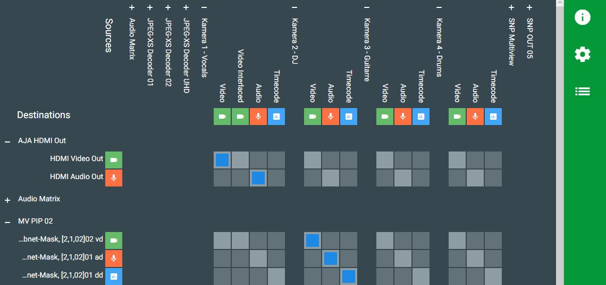
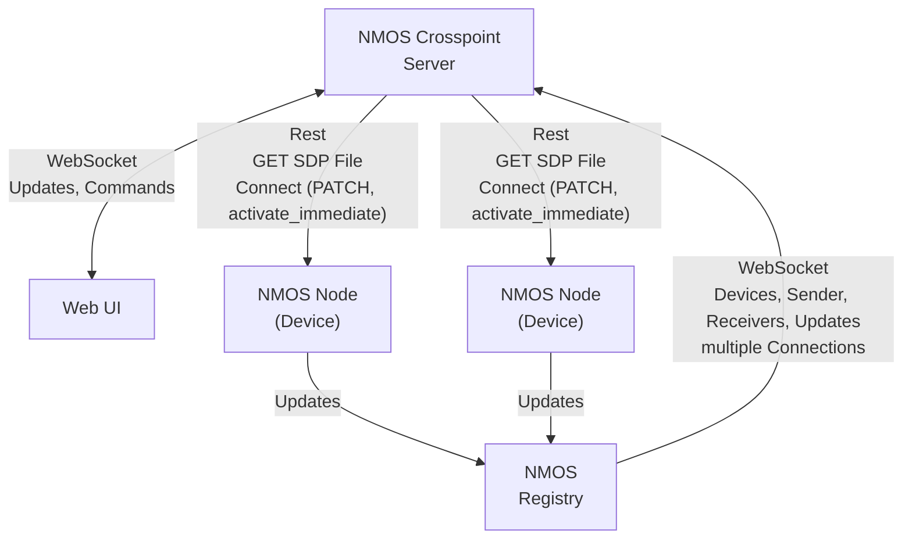

# NMOS Crosspoint

This tool is intended as a simple Orchestration layer for NMOS and ST2110 based Media Networks. 



This tool is tested against a lot of devices and now stable and performant with more than 2000 Flows.

## Features

- List of all NMOS Devices and Flows in the Network
- Connecting Flows to Receivers (Crosspoint style)
- Integration for prorietary device overview and control
- Connection to Companion (Beta)
- Managing of all Multicast adresses (Beta)
- Reconnect on flow changes

## Planned features

- Virtual senders and receivers
- Network topology view
- Active, network aware routing (SDN Like)
- IS-07 ( Connecting WebSocket Data Streams is already working with easy-nmos-node )
- IS-08 ( Work in progress)

## TODO

- Documentation !

## Changes from Version 1.0

- Complete redesign of the server core for supporting more features
- Multithreaded Server
- Complete redesign of the UI. (Switched from Angular to Svelte due to performance)
- Added basics for implementation of device abstractions
- Lot of Bug fixing

## Dependencies

This tool needs a working NMOS Registry running in the network. We test against [nmos-cpp](https://github.com/sony/nmos-cpp) in a docker container.

To get one up and running, you can use the one provided by rhastie: [https://github.com/rhastie/build-nmos-cpp](https://github.com/rhastie/build-nmos-cpp)

## Configuration

You can simply rename the `server/config_example` folder to `server/config` please see the config files for possible Settings, documentation has to be done.

## Installation

The simplest way to get NMOS Crosspoint up and running is to use Docker Compose.

Make sure to change `docker-compose.yml` for your environment.
```shell
docker-compose up
```
This will create and start one Docker Container with a node express server.
Just point your Browser to the IP of the created Docker Container at port 80

## Just run it !

If you have a NMOS Registry in the network (Easy-NMOS for example) you can just start this tool on any computer.
You will need an Installation of Node.js Version 20, change to the `server`folder and just run: `node ./dist/server.js`.

## Network

NMOS Crosspoint can find and use multiple Registries, over all attached networks. Usually I test in an environment with the following networks:
- OOB (Out of Band Management network)
- Amber (Main Media network)
- Blue (Backup Media network)

NMOS Crosspoint can be connected to even more networks and will try to reach devices over multiple interfaces if they provide multiple endpoints to the registry.
In theory, one should be able to get a complete failover. 

At this time, NMOS Crosspoint does not handle the multiple "Legs" (network interfaces) presented by NMOS in a inteligent way. So there is no mapping for subnets or any desicion which Legs can connect.
Leg 1 of a sender is always connected to Leg 1 of a receiver, the SDP Manifest files are not modified in any way. 
There are plans to see the whole network topology and handle lots of these things.

Unfortunately, some devices do not present their NMOS API on all interfaces. So for best compatibility, NMOS Crosspoint and the API should be present in all networks. If the NMOS Registry is configured manually in the devices, one can also use routing.

## How it works




## Development

```
docker-compose up nmos-crosspoint-dev
```
Will start one Docker Container with a live updating Node Server.
For both folders, `/ui` and `/server` you could also run `npm install` and `npm run dev` for a local development session. 

In development mode it is extremely usefull for debugging as you can nearly live modify patch commands and the interpretation of NMOS data. under `http://<ip:port>/debug` you can see the full live updating crosspoint and NMOS data. Under `http://<ip:port>/log` there is lots of usefull data while making connections.

## Standalone

It is possible to run this tool without docker. Still there is need for a NMOS Registry, nmos-cpp can be built and operated without Docker.

```shell
# build the angular app
cd ./ui
npm install --force         # force is required for ace (json rendering, to be fixed or replaced)
npm run build                
cd ..

# build the server (typescript has to be globally available)

cd ./server
npm install
# optional:    npm install -g typescript@latest
tsc
node ./dist/server.js
```

Check the `Dockerfile.dev` for information on how to start live development servers.


