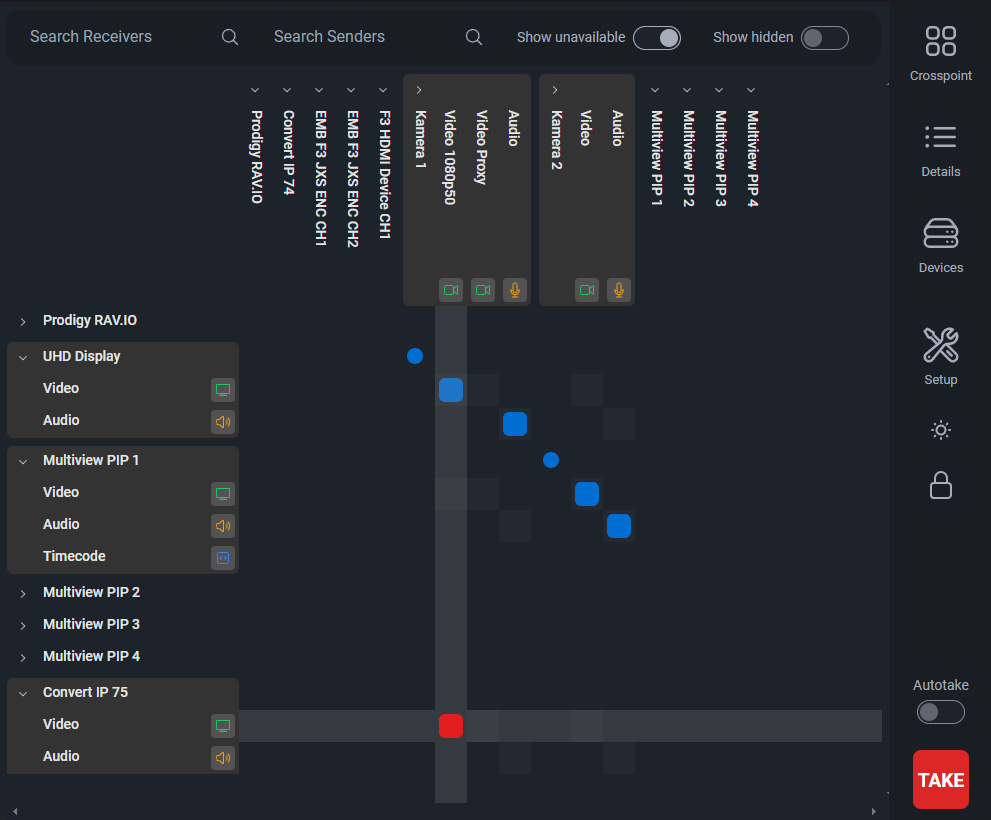

# NMOS Crosspoint

This tool is intended for demonstrating and testing the NMOS API. As of now, there is no intention for production use.




## Dependencies

This tool needs a working NMOS Registry running in the network. We test against [nmos-cpp](https://github.com/sony/nmos-cpp) in a docker container.

To get one up and running, you can use the one provided by rhastie: [https://github.com/rhastie/build-nmos-cpp](https://github.com/rhastie/build-nmos-cpp)

## Installation

The simplest way to get NMOS Crosspoint up and running is to use Docker Compose.

Make sure to change `docker-compose.yml` for your environment.
```shell
docker-compose up
```
This will create and start one Docker Container with a node express server.
Just point your Browser to the IP of the created Docker Container at port 80

## Network

NMOS Crosspoint can find and use multiple Registries, over all attached networks. Usually I test in an environment with the following networks:
- OOB (Out of Band Management network)
- Amber (Main Media network)
- Blue (Backup Media network)

NMOS Crosspoint can be connected to even more networks and will try to reach devices over multiple interfaces if they provide multiple endpoints to the registry.
In theory, one should be able to get a complete failover. NMOS Crosspoint does not handle the multiple "Legs" (network interfaces) presented by NMOS in a inteligent way. So there is no mapping for subnets or any desicion which Legs can connect.
Leg 1 of a sender is always connected to Leg 1 of a receiver, the SDP Manifest files are not modified in any way.

Unfortunately, some devices do not present their NMOS API on all interfaces. So for best compatibility, NMOS Crosspoint and the API should be present in all networks. This lead to the decision of making a Client Server tool. The Server can can access all the endpoints, the Client (webinterface) can be opened on a tablet in a WiFi without access to the Media networks.

## How it works


## In Progress and To-dos

NMOS Crosspoint is created by testing devices. It does not completely follow the Standars due to some compatibility issues.

- Detecting multiple Endpoints for single NMOS Node with multiple Registries
- IS-07 (Connecting WebSocket Data Streams is already working with easy-nmos-node)
- IS-08 
- Performance of UI (Browser gets unresponsive sometimes)
- Peer to Peer Mode, without Registry

## Static NMOS Registry configuration

If there is no working mDNS or the Registry is behind a Router, one can add the Registry by config file: `./server/config/settings.json`

Example:
```json
{
    "staticNmosRegistries":[
        {"ip":"10.1.0.2", "port":80, "priority":1000, "domain":""}
    ]
}
```

## Development

```
docker-compose up nmos-crosspoint-dev
```
Will start one Docker Container with an Angular Development Server and a Node Server. Both are live updating on changed files.

Coding was made Quick and Dirty and is kept like this while testing new functions.

## Standalone

It is possible to run this tool without docker. Still there is need for a NMOS Registry, nmos-cpp can be built and operated without Docker.

```shell
# build the angular app
cd ./app
npm install --force         # force is required for ace (json rendering, to be fixed or replaced)
npm run build
cd ..             

# build the server (typescript has to be globally available)
cd ./server
npm install
# optional:    npm install -g typescript@latest
tsc
node ./dist/server.js
```

Check the `Dockerfile.dev` for information on how to start live development servers.


Copyright (C) 2021 Johannes Grieb

